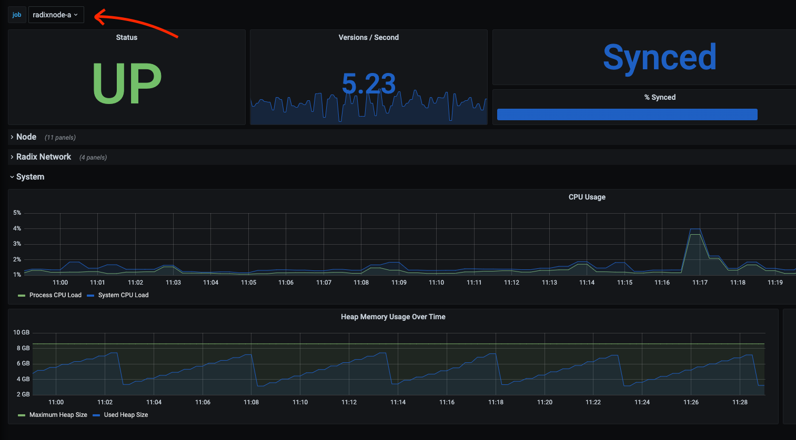

<div align="center">
	<br>
	<br>
  
  <p>
    To support <a href="https://vnode.network">vnode.network</a> open source, please consider staking with our <a href="https://vnode.network">validator</a>.
  </p>
	<br>
	<br>
</div>

## radix-node-multi-job

This is a fork of the ["offical" grafana dashboard](https://github.com/radixdlt/node-runner/blob/main/monitoring/grafana/provisioning/dashboards/sample-node-dashboard.json) but with added support for multiple jobs. This dashboard is useful if you want to run one Prometheus/Grafana installation for monitoring several Radix nodes.



### Installation

Either put the [radix-node-multi-job.json](dashboards/radix-node-multi-job.json) dashboard file in your grafana dashboards folder, or do a direct import of the [json file](dashboards/radix-node-multi-job.json) in the Grafana UI.

### Updating Promethus to scrape multiple nodes

This dashboard only really makes sense if you configured your Prometheus instance to scrape multiple Radix nodes with unique job names.

This is a sample Prometheus configuration with multiple scrape configs:

```yaml
global:
  evaluation_interval: 30s
  scrape_interval: 30s
  scrape_timeout: 20s
scrape_configs:
  - basic_auth:
      password: ...
      username: ...
    job_name: radixnode-a
    scheme: https
    static_configs:
      - targets:
          - 10.1.0.50
    tls_config:
      insecure_skip_verify: true
  - basic_auth:
      password: ...
      username: ...
    job_name: radixnode-b
    scheme: https
    static_configs:
      - targets:
          - 10.2.0.50
    tls_config:
      insecure_skip_verify: true
```
